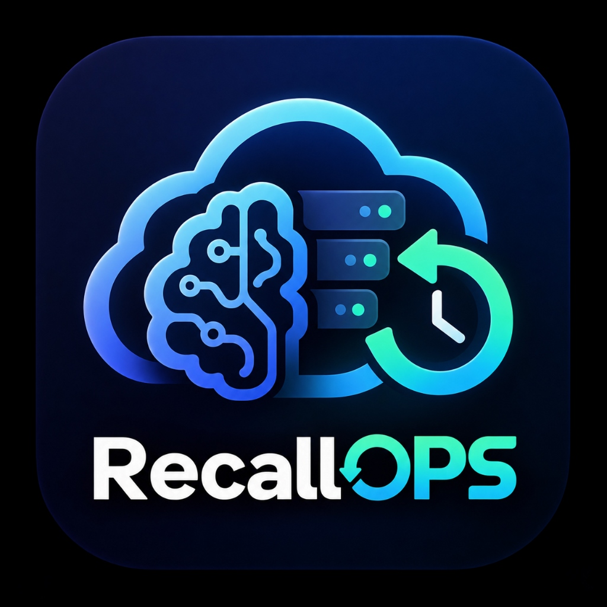
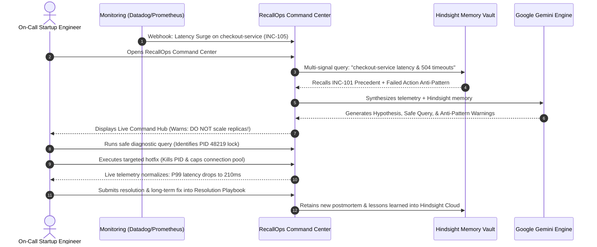

<p align="center">
  
</p>

# RecallOps

> **Autonomous AI Incident Response Command Center with Persistent SRE Memory**  
> *Built for Hack with Hyderabad 3.0 — Powered by Hindsight (Vectorize) & Google Gemini*

[](https://www.python.org/)
[-brightgreen)](https://hindsight.vectorize.io/)
[-blue)](https://ai.google.dev/)
[](https://streamlit.io/)
[](LICENSE)

---

## 🎯 The Problem

When production outages strike—APIs timing out, connection pools saturating, cache stampedes crashing databases—on-call engineers face two grueling challenges:
1. **Investigating unfamiliar telemetry under extreme pressure.**
2. **Remembering if the team experienced this failure before, what worked, and what made things worse.**

Most AI chatbots treat memory as a glorified chat history. They provide generic advice (*"Have you tried restarting the pods or scaling out replicas?"*). But in complex distributed architectures, **generic advice can turn a minor degradation into a catastrophic total outage**.

---

## 💡 The Solution: RecallOps

**RecallOps** is an intelligent Incident Command Center where **Hindsight persistent memory is the hero**. It accumulates institutional SRE wisdom over time, learning not just what happened, but **distinguishing between actions that failed, actions that proved ineffective, and actions that actually resolved the incident**.

When a new incident occurs, RecallOps:
1. **Recalls relevant historical incidents** using multi-signal contextual relevance.
2. **Explains why they are relevant** (no black-box vector dumps).
3. **Warns against anti-patterns and previous failed actions** (*"DO NOT scale replicas; in INC-101 this overwhelmed the database connection pool"*).
4. **Recommends safe, read-only diagnostic checks** to verify root causes.
5. **Suggests evidence-backed mitigations** with tiered tactical and long-lasting architectural solutions.
6. **Learns continuously** by committing new postmortems and investigation journeys back into Hindsight Cloud.

---

## 🛠️ Technologies Used

RecallOps is architected with a decoupled, enterprise-grade technology stack:

| Layer | Technology | Role & Purpose |
| :--- | :--- | :--- |
| **Frontend UI** | **Streamlit & Custom CSS** | Builds the multi-tab Incident Command Center (`Overview`, `Incidents`, `Memory`, `Investigate`, `Resolution`, `Settings`). Styled with a high-contrast dark enterprise theme, non-editable custom dropdowns, and responsive KPI hero cards. |
| **Cognitive Memory** | **Hindsight Cloud (Vectorize v0.10.1)** | Provides persistent episodic, semantic, and procedural memory. Retains postmortems, indexes action outcomes (`action:failed`, `action:successful`), and executes cognitive reflections via `recallops-vault`. |
| **AI Reasoning Engine** | **Google Gemini (`gemini-2.5-flash-lite`)** | High-speed, high-reasoning LLM that synthesizes raw telemetry with recalled Hindsight memory to generate incident hypotheses, anti-pattern warnings, and safe diagnostic queries. |
| **Fallback LLM Engine** | **Groq (`llama-3.3-70b-versatile`)** | High-throughput secondary LLM provider ensuring high availability if upstream quotas are constrained. |
| **Data Models & Schemas** | **Pydantic v2** | Enforces strict, type-safe data validation across incidents, action attempts, telemetry metrics, and memory records. |
| **Relevance Engine** | **Python (NumPy, Regex, Jaccard)** | Computes multi-signal relevance ranking across service topology (25%), symptom patterns (35%), triggers (20%), and metric profiles (20%). |
| **Terminal & CLI** | **Rich** | Delivers formatted CLI triage reports, tables, and colored diagnostic traces directly in the developer terminal. |
| **Automated Testing** | **Streamlit AppTest & Unittest** | Provides end-to-end automated UI simulation and backend unit tests to ensure continuous deployment stability. |

---

## 🏢 How a Startup Client Uses RecallOps (Workflow & Business Value)

Imagine a fast-growing startup, **"FinFlow"** (15 engineers, 8 microservices, 50,000 daily active users).

### The Startup's Dilemma
- **Small Team, High Velocity**: They deploy code 10 times a day.
- **Tribal Knowledge Risk**: When a senior engineer leaves, their debugging wisdom leaves with them.
- **Costly Downtime**: A 45-minute checkout outage during peak hours costs $25,000 and causes customer churn.
- **Repeated Mistakes**: Junior engineers on-call at 2 AM repeat past mistakes (e.g. restarting pods during database lock contention).

### Step-by-Step Client Lifecycle Workflow



### Concrete ROI for the Startup
1. **85% Reduction in MTTR**: Incidents that previously took 45 minutes to troubleshoot are diagnosed in under 90 seconds.
2. **Elimination of Repeat Outages**: Anti-patterns (like scaling replicas during connection pool exhaustion) are caught and flagged before execution.
3. **Institutional Memory Retention**: Debugging experience is owned by the company's memory vault, not trapped in individual engineers' heads.
4. **Faster On-Call Ramp-Up**: Junior engineers can handle SEV-1 incidents with the confidence of a Staff SRE.

---

## 🏛️ System Architecture

```
                                  +-------------------------------------+
                                  | Streamlit Command Center (app.py)   |
                                  | Overview | Memory | Investigate ... |
                                  +------------------+------------------+
                                                     |
                                                     v
                                  +-------------------------------------+
                                  |      RecallOps SRE Agent (/agent)   |
                                  +------------------+------------------+
                                                     |
                   +---------------------------------+---------------------------------+
                   |                                                                   |
                   v                                                                   v
+--------------------------------------+                             +--------------------------------------+
|  Multi-Signal Relevance Engine       |                             |     Hindsight Cloud Memory Adapter   |
|  - Service Topology Match (25%)      |                             |     - Bank: recallops-vault          |
|  - Symptom Pattern Match (35%)       |                             |     - retain() / recall() / reflect()|
|  - Trigger Context Match (20%)       |                             |     - Action-Outcome Decomposition   |
|  - Metric Profile Match (20%)        |                             |     - Resilient Offline Mirror       |
+--------------------------------------+                             +--------------------------------------+
                   |                                                                   |
                   +---------------------------------+---------------------------------+
                                                     |
                                                     v
                                  +-------------------------------------+
                                  | Google Gemini Engine                |
                                  | Model: gemini-2.5-flash-lite        |
                                  | Fallback: Groq / Deterministic SRE  |
                                  +-------------------------------------+
```

---

## 🖥️ Command Center Interface (6 Dedicated Tabs)

1. **Overview**: Incident Command Hub featuring active incident KPI cards (P99 Latency, Error Rate, DB Connections, Recent Changes), a clickable 5-step workflow row, recent incident catalog table, and the Hindsight memory status glance.
2. **Incidents**: Complete organizational incident catalog with status filters (`ACTIVE` vs. `RESOLVED`) and historical timeline inspector.
3. **Memory**: Direct explorer for Hindsight Cloud cognitive memory units (`recallops-vault`). Supports semantic recall search across postmortems, action outcomes, and runbook patterns.
4. **Investigate**: AI Investigation Workbench. Compares **"WITH TEAM MEMORY"** (Gemini + Hindsight) against **"WITHOUT MEMORY"** (Generic AI). Features real-time read-only diagnostic SQL queries and advisory remediation.
5. **Resolution**: Multi-tiered resolution playbook detailing immediate triage hotfixes, intermediate operational guardrails (`statement_timeout`), and long-lasting permanent architecture (PostgreSQL compound indexes and Redis caching).
6. **Settings**: Real-time health monitor for Google Gemini and Hindsight Cloud, with one-click demo state resets and memory baseline re-seeding.

---

## 🚀 Quickstart Guide

### 1. Clone & Install
```bash
git clone https://github.com/AbhinavDharam/HackWithHyderabad.git
cd HackWithHyderabad

# Install dependencies
pip install -r requirements.txt
```

### 2. Configure Secrets (.env)
Create a `.env` file in the project root:
```env
# Google Gemini API Key
GEMINI_API_KEY=your_gemini_api_key_here
GEMINI_MODEL=gemini-2.5-flash-lite

# Hindsight Cloud Memory
HINDSIGHT_API_KEY=your_hindsight_api_key_here
HINDSIGHT_BANK_ID=recallops-vault
HINDSIGHT_BASE_URL=https://api.hindsight.vectorize.io

# Optional Secondary Fallback (Groq)
GROQ_API_KEY=your_groq_api_key_here
```

### 3. Verify System Health
Run the automated diagnostic suite to test connections to Gemini and Hindsight Cloud:
```bash
python test_connection.py
```

### 4. Bootstrap Memory Bank
Ingest baseline historical incidents into your Hindsight Cloud vault:
```bash
python seed_memory.py
```

### 5. Launch Command Center
```bash
streamlit run app.py
```
Open **`http://localhost:8501`** in your browser.

---

## 🧪 Running Automated Tests

```bash
# Automated UI Workflow Tests
python tests/test_app_ui.py

# Core Backend Unit Tests
python tests/test_recallops.py
```

---

## 📁 Repository Layout

```text
HackWithHyderabad/
├── app.py                         # Streamlit Incident Command Center Web Application
├── seed_memory.py                 # CLI Seeder for Hindsight Cloud memory bank
├── test_connection.py             # System & API diagnostic test suite
├── requirements.txt               # Project dependencies
├── .env.example                   # Environment configuration template
├── assets/
│   └── logo.png                   # Official RecallOps brand logo
├── data/
│   └── synthetic_incidents.json   # High-fidelity production incident dataset
├── recallops/
│   ├── config.py                  # API credentials and environment loader
│   ├── cli.py                     # Command-line investigation interface
│   ├── models/                    # Pydantic data schemas
│   │   ├── incident.py            # Incident, ActionAttempt, ActionOutcome models
│   │   └── memory_record.py       # RelevanceScoreBreakdown, HistoricalMatch models
│   ├── memory/                    # Hindsight memory integration
│   │   ├── hindsight_adapter.py   # Hindsight retain/recall/reflect cloud client
│   │   └── memory_formatter.py    # Cognitive unit decomposition
│   ├── retrieval/                 # Multi-signal relevance scoring engine
│   │   ├── relevance_engine.py    # 4-signal heuristic ranking
│   │   └── explanation_builder.py # Transparent reasoning generator
│   ├── agent/                     # Autonomous SRE agent
│   │   ├── sre_agent.py           # Investigation orchestrator
│   │   └── prompt_templates.py    # SRE prompts with anti-pattern guardrails
│   ├── incidents/
│   │   └── incident_manager.py    # Incident persistence & resolution manager
│   └── llm/
│       └── llm_client.py          # Unified client (Gemini / Groq / Fallback)
└── tests/
    ├── test_app_ui.py             # Automated UI workflow tests (Streamlit AppTest)
    └── test_recallops.py          # Core backend unit test suite
```

---

## 🏆 Hackathon Alignment (Hack with Hyderabad 3.0)

| Criterion | Weight | How RecallOps Delivers |
| :--- | :---: | :--- |
| **Innovation** | **30%** | Moves beyond conversational chatbots into an advisory SRE copilot that tracks *action-outcome causality* (Failed vs. Effective vs. Succeeded). |
| **Use of Hindsight Memory** | **25%** | Hindsight is the central nervous system: memory units are decomposed into postmortems, action experiences, and runbook anti-patterns using `retain`, `recall`, and `reflect`. |
| **Technical Implementation** | **20%** | Decoupled modular architecture, Google Gemini reasoning, Pydantic type safety, multi-signal relevance scoring, and automated test coverage. |
| **User Experience** | **15%** | Tabbed Incident Command Center, responsive KPI cards, instant global search, interactive SQL diagnostics, and multi-tier resolution playbook. |
| **Real-world Impact** | **10%** | Drastically cuts MTTR, prevents repeating costly production mistakes, and institutionalizes engineering knowledge across team turnover. |
